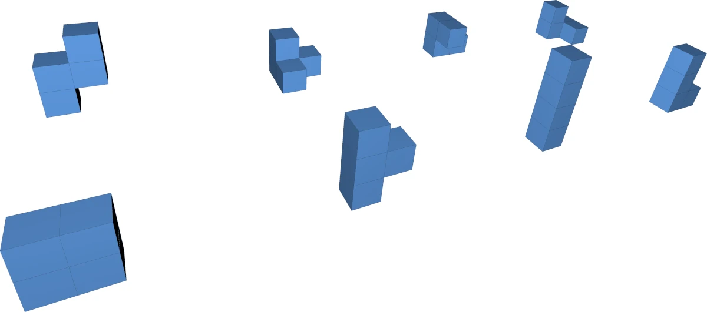
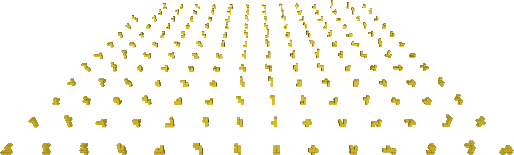
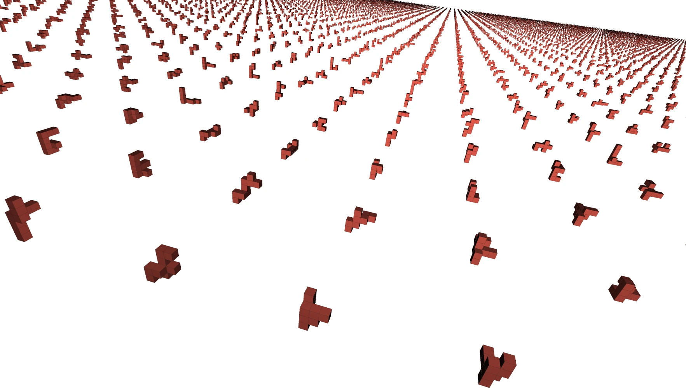

# Polycubes

This program generates [polycubes](https://en.wikipedia.org/wiki/Polycube):
3D shapes made up of a number of equal cubes, attached face-to-face.

It was inspired by the recent [Computerphile video](https://www.youtube.com/watch?v=g9n0a0644B4)
featuring Computerphile regular Mike Pound. Do watch the video for an introduction
and check out [Mike Pound's implementation](https://github.com/mikepound/cubes).

## What's different about this one?

The algorithm implemented here is largely the same as what's described in the
Computerphile video (albeit implemented in C++, not Python): To find all *n*-cubes,
we start with a list of all *(n-1)*-cubes. For each smaller polycube, we go through
all valid location where we can add an additional cube, and then check if the
resulting shape is already in the list, taking into account rotation. If it is
not, we add it.

There is one major difference to Mike Pound's implementation: The shapes are
stored differently, and how we take into account the rotation of the shapes is
also different.

The polycubes are stored **as a list of coordinates** (not as bitmaps), and they
are **normalized** so that we don't have to look up all possible rotations.

The normalization relies on imposing an arbitrary “lexical” order on both the
individual coordinates (sort by *x*, then *y*, then *z*) and on the coordinate-list
representations of the polycubes (sort by the first coordinate in the list, then
the second, and so on), and works as follows:

1. Generate the 24 different rotations of the shape
2. Shift the coordinate systems such that min(*x*) = 0 ∧ min(*y*) = 0 ∧ min(*z*) = 0
   for each of the 24 rotated variants
3. Sort the 24 coordinate lists lexically (i.e. the order of coordinates
   is made irrelevant)
4. Pick whichever one of the 24 variants comes first by lexical order as the
   “normal” representation

All rotated and translated versions of a particular polycube are thus consolidated
into one (fundamentally arbitrary) normalized form. This saves us from having to
look up all the 24 rotations individually.

## How to build and use

This C++ project is built with the uniquitous CMake. Run:

    mkdir build
    cd build
    cmake .. -DCMAKE_BUILD_TYPE=Release
    cmake --build . --config=Release

Tested on Linux with GCC 13, Windows with Visual C++ 2022, and MacOS with GCC 13.

Compatibility notes:
 * On Linux, you need to have TBB installed (`apt install libtbb-dev` on Ubuntu)
 * On MacOS, you need to have TBB installed (`brew install tbb`) and you *must*
   use GCC (`brew install gcc`), Clang will not work! Configure like this:

       CXX=g++-13 cmake .. -DCMAKE_BUILD_TYPE=Release

    and continue as on the other platforms.

The project builds two executables: `polycubegen` and `polycubes2obj`.

* `polycubegen` is the main program; run (from the build directory)

      mkdir out
      ./src/polycubegen -n 10 out

  to find all polycubes up to size 10 (this will write a bunch of binary files
  to the directory `out`)
* `polycubes2obj` generates an OBJ file that can be rendered with a tool like
  [MeshLab](https://www.meshlab.net/) from the output of `polycubegen`:

      ./src/polycubes2obj out/polycubes_6.bin

  Note: OBJ is a text file format, so the resulting file is significantly larger
  than the binary list! It works ok up to at least around n = 9.

Note: on *Windows*, the executables might be placed at `.\src\Release\*.exe`.

## The file format

The list of polycubes is stored in a simple binary format that is documented here
in case you want to do some further processing on the results:

The file stars with the ASCII string `PLYCUBE1` (8 bytes), followed by the number
*n* of cubes per polycube, as a 32-bit little-endian integer.

The rest of the file is just the coordinates: 1 byte per value, 3 bytes per
(x, y, z) triplet, and *n* such triplets per polycube (3*n* bytes per polycube).

## Performance and space requirements

On my desktop, all polycubes up to n = 12 are found within about two minutes.
This uses about 1.5GB of RAM. Finding all up to n = 13 takes about 20 minutes
on the same machine and uses some 11GB of memory.

From n = 13, the program stores some interim results in files. This creates some
overhead, but keeps memory usage in check.
